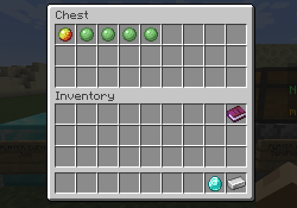

# 1L Mod
A 1.21.5 fabric utility mod for the server DiamondFire.

# Commands
| Command                        | Description                               |
|--------------------------------|-------------------------------------------|
| `/onelmod` `/onel`             | opens the config menu                     |
| `/onel expr` `/expr`           | creates a number value from an expression |
| `/onel smallcaps` `/smallcaps` | convert text to small capital letters     |

# Dependencies
| Dependency                                                                | Version   |
|---------------------------------------------------------------------------|-----------|
| [Yet Another Config Lib](https://modrinth.com/mod/yacl)                   | \>=3.7.1  |
| [Fabric Language Kotlin](https://modrinth.com/mod/fabric-language-kotlin) | \>=1.10.8 |

# Miscellaneous features
### No unverified messages toast
Disables the "Messages sent on this server may be modified..." toast that shows
up when joining diamondfire.

### Mode change toasts
Displays a toast when switching modes (play, build, dev).

### Anti network protocol error
Makes network protocol errors display a toast instead of disconnecting you
from the server.

### Direct message notifications
Sends a tray notification when Minecraft is unfocused, and you receive a direct message.

# Dev features
### Expression command
Makes %math, %index and %var expressions easier to write.

| Example         | Result                                   |
|-----------------|------------------------------------------|
| `10 + 5`        | `%math(10 + 5)`                          |
| `10 + 5 * 2`    | `%math(10 + %math(5 * 2))`               |
| `10 * variable` | `%math(10 * %var(variable))`             |
| `loc.x + loc.y` | `%math(%index(loc, 1) + %index(loc, 2))` |
| `(10 * 5) ^ 2`  | `%math(%math(10 * 5) * %math(10 * 5))`   |

### Middle click value pick
Makes middle click give you a single one of the clicked item in code chests.

